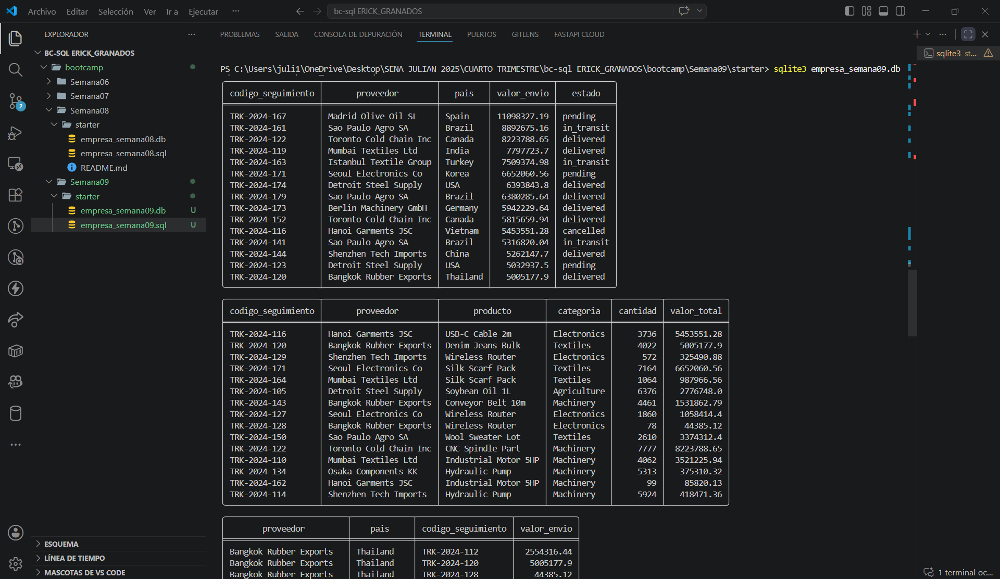
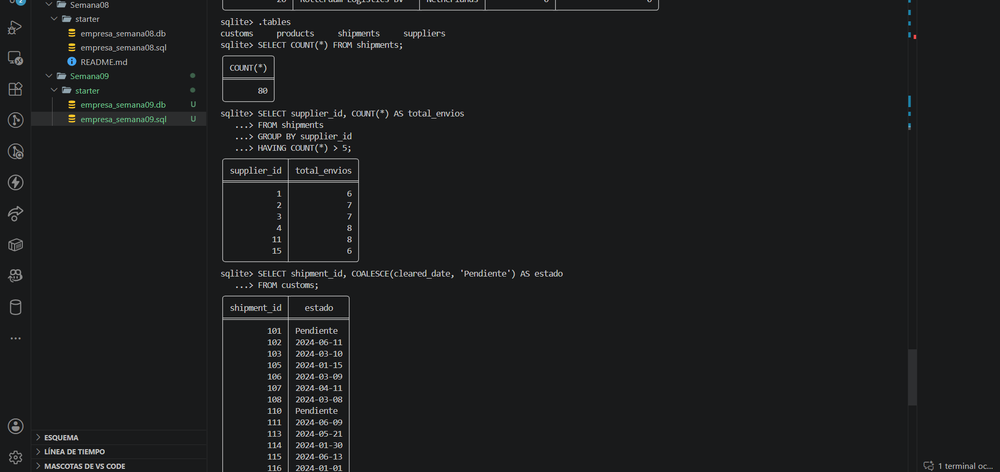

# Proyecto Semana 09 — JOINs aplicados a tu dominio

**Dominio asignado:** Empresa de Importación (bc-sql)

---

## 📋 Descripción

Este proyecto aplica `INNER JOIN` y `LEFT JOIN` sobre el esquema de importación
para generar reportes relacionales y detectar registros huérfanos: proveedores
sin envíos registrados y envíos sin trámite de aduana asociado.

---

## 🗂️ Estructura del esquema

| Tabla         | Rol                  | Filas | Huérfanos incluidos                          |
|---------------|----------------------|-------|-----------------------------------------------|
| `suppliers`   | Referencia            | 20    | 5 proveedores sin ningún envío                |
| `products`    | Referencia            | 20    | 5 productos sin ningún envío                  |
| `shipments`   | **Principal**         | 80    | —                                              |
| `customs`     | Secundaria (hija)     | 65    | 15 envíos sin trámite de aduana registrado    |

**Relaciones (FK):**
- `suppliers (1) → (N) shipments`
- `products (1) → (N) shipments`
- `shipments (1) → (1) customs`

Los huérfanos no son un error: se incluyeron a propósito para que el
`LEFT JOIN` y el filtro `WHERE ... IS NULL` tengan sentido real al evaluarlos.

---

## 🔗 Consultas con JOIN incluidas

| # | Consulta | Tipo |
|---|----------|------|
| 1 | Envíos con su proveedor | `INNER JOIN` (2 tablas) |
| 2 | Envíos + proveedor + producto | `INNER JOIN` (3 tablas) |
| 3 | Todos los proveedores, con o sin envíos | `LEFT JOIN` |
| 4 | Proveedores sin ningún envío (huérfanos) | `LEFT JOIN` + `WHERE IS NULL` |
| 4b| Envíos sin trámite de aduana (huérfanos) | `LEFT JOIN` + `WHERE IS NULL` |
| 5 | Cantidad de envíos por proveedor (incluye 0) | `LEFT JOIN` + `GROUP BY` + `COUNT` |

---

## ▶️ Cómo ejecutar el proyecto

### 1. Abre SQLite apuntando al archivo `.db`

```bash
sqlite3 empresa_semana09.db
```

👉 Si el archivo no existe, SQLite lo crea vacío.

### 2. Ejecuta tu script `.sql` completo

Dentro del prompt de SQLite:

```sql
.read proyecto_semana09.sql
```

👉 Esto corre todo tu archivo: crea las tablas, inserta los datos
(suppliers, products, shipments, customs) y ejecuta las 5 consultas con JOIN.

### 3. Verifica que las tablas se crearon

```sql
.tables
```

👉 Te debe mostrar `suppliers`, `products`, `shipments`, `customs`.

### 4. Prueba tus consultas de evidencia

```sql
SELECT COUNT(*) FROM shipments;

SELECT supplier_id, COUNT(*) AS total_envios
FROM shipments
GROUP BY supplier_id
HAVING COUNT(*) > 5;

SELECT shipment_id, COALESCE(cleared_date, 'Pendiente') AS estado
FROM customs
WHERE cleared = 0;
```

### 5. Salir de SQLite

```sql
.exit
```

---
## Capturas de pantalla


---


---

## 📁 Archivos del proyecto

```
.
├── proyecto_semana09.sql   # Script completo: DDL + DML + 5 consultas con JOIN
├── empresa_semana09.db     # Base de datos generada (SQLite format 3)
└── README.md               # Este archivo
```

---

## ✅ Checklist de requisitos cumplidos

- [x] `PRAGMA foreign_keys = ON;` al inicio
- [x] Esquema con mínimo 3 tablas relacionadas vía FK
- [x] ≥80 filas en tabla principal (`shipments`: 80)
- [x] ≥20 filas en cada tabla secundaria (`suppliers`: 20, `products`: 20)
- [x] Registros sin cruce para que el LEFT JOIN tenga valor (proveedores, productos y envíos huérfanos)
- [x] Consulta 1 — INNER JOIN principal
- [x] Consulta 2 — JOIN con tres tablas
- [x] Consulta 3 — LEFT JOIN con todos los registros del padre
- [x] Consulta 4 — Detección de huérfanos con `IS NULL`
- [x] Consulta 5 — Reporte agregado con LEFT JOIN + GROUP BY + COUNT
- [x] Aliases de tabla usados en todas las consultas
- [x] Comentarios en español explicando cada consulta
- [x] Ningún `SELECT *`
- [x] Archivo ejecuta sin errores de principio a fin