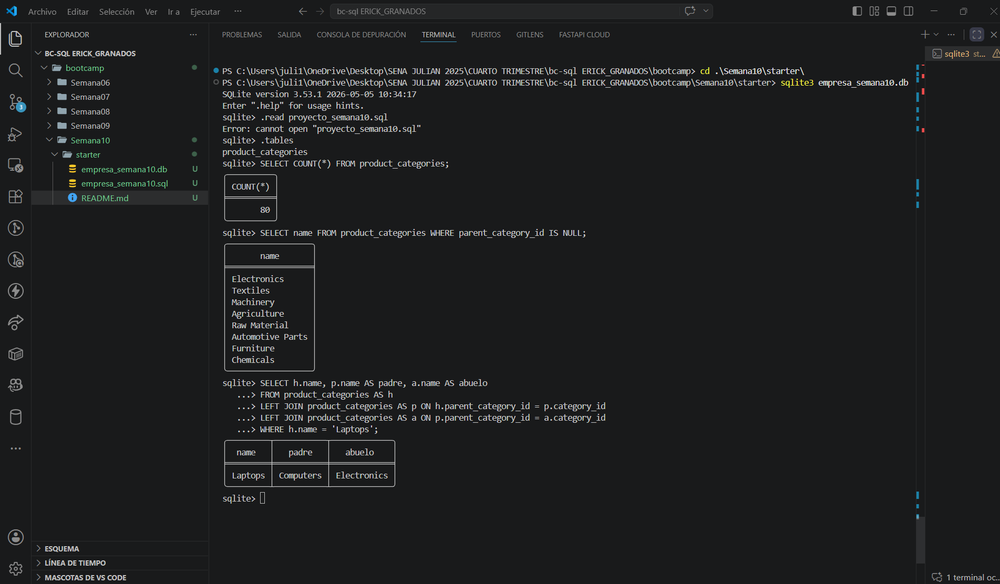

# Proyecto Semana 10 — SELF JOIN en tu dominio

**Dominio asignado:** Empresa de Importación (bc-sql)

---

## 📋 Descripción

Este proyecto modela el **árbol de categorías de productos** que importa la
empresa usando una sola tabla con auto-referencia (`parent_category_id`).
Se aplican distintas variantes de `SELF JOIN` para recorrer la jerarquía:
de hijo a padre, incluyendo raíces, contando hijos por padre, y reconstruyendo
la cadena completa hoja → padre → abuelo.

**Ejemplo de jerarquía real en los datos:**

```
Electronics (nivel 1, raíz)
└── Computers (nivel 2)
    ├── Laptops (nivel 3, hoja)
    ├── Desktop PCs (nivel 3, hoja)
    └── Tablets (nivel 3, hoja)
```

---

## 🗂️ Estructura del esquema

| Tabla                 | Columna auto-referencial | Filas | Niveles |
|-----------------------|---------------------------|-------|---------|
| `product_categories`  | `parent_category_id`      | 80    | 3       |

| Nivel | Significado          | Filas |
|-------|------------------------|-------|
| 1     | Categoría raíz (sin padre) | 8     |
| 2     | Subcategoría           | 22    |
| 3     | Hoja (categoría final) | 50    |

`parent_category_id` es una **FK que apunta a la misma tabla**
(`product_categories.category_id`). Las 8 categorías raíz tienen
`parent_category_id = NULL`.

---

## 🔗 Consultas con SELF JOIN incluidas

| # | Consulta | Tipo |
|---|----------|------|
| 1 | Hijo → padre (excluye raíces) | `INNER JOIN` (self join, aliases `h`/`p`) |
| 2 | Hijo → padre, incluyendo raíces | `LEFT JOIN` + `COALESCE` |
| 3 | Cantidad de hijos por padre (solo con ≥1 hijo) | `LEFT JOIN` + `GROUP BY` + `COUNT` + `HAVING` |
| 4 | Hoja → padre → abuelo (3 niveles) | `LEFT JOIN` encadenado con 3 aliases (`h`, `p`, `a`) |

---

## ▶️ Cómo ejecutar el proyecto

### 1. Abre SQLite apuntando al archivo `.db`

```bash
sqlite3 empresa_semana10.db
```

👉 Si el archivo no existe, SQLite lo crea vacío.

### 2. Ejecuta tu script `.sql` completo

Dentro del prompt de SQLite:

```sql
.read proyecto_semana10.sql
```

👉 Esto corre todo tu archivo: crea la tabla `product_categories`,
inserta las 80 categorías en 3 niveles, y ejecuta las 4 consultas con SELF JOIN.

### 3. Verifica que la tabla se creó

```sql
.tables
```

👉 Te debe mostrar `product_categories`.

### 4. Prueba tus consultas de evidencia


```sql
-- Total de categorías
SELECT COUNT(*) FROM product_categories;

-- Categorías raíz (sin padre)
SELECT name FROM product_categories WHERE parent_category_id IS NULL;

-- Hoja -> padre -> abuelo, para una categoría específica
SELECT h.name, p.name AS padre, a.name AS abuelo
FROM product_categories AS h
LEFT JOIN product_categories AS p ON h.parent_category_id = p.category_id
LEFT JOIN product_categories AS a ON p.parent_category_id = a.category_id
WHERE h.name = 'Laptops';
```

### 5. Salir de SQLite

```sql
.exit
```

---
## Capturas de pantalla


---

## 📁 Archivos del proyecto

```
.
├── proyecto_semana10.sql   # Script completo: DDL + DML + 4 consultas con SELF JOIN
├── empresa_semana10.db     # Base de datos generada (SQLite format 3)
└── README.md               # Este archivo
```

---

## ✅ Checklist de requisitos cumplidos

- [x] Tabla con columna auto-referencial (`parent_category_id`) definida como FK
- [x] ≥80 filas en la tabla principal (80 categorías)
- [x] Al menos 3 niveles de jerarquía (raíz → subcategoría → hoja)
- [x] Al menos un registro raíz (`parent_category_id = NULL`) — hay 8
- [x] Consulta 1 — SELF JOIN básico con INNER JOIN, excluye raíces
- [x] Consulta 2 — LEFT JOIN + COALESCE, incluye raíces con etiqueta descriptiva
- [x] Consulta 3 — LEFT JOIN + GROUP BY + COUNT + HAVING (solo padres con hijos)
- [x] Consulta 4 — Tres aliases encadenados (hijo → padre → abuelo) con LEFT JOIN
- [x] Dos (y hasta tres) aliases descriptivos reflejando el rol en la jerarquía
- [x] Comentarios en español explicando cada consulta
- [x] Archivo ejecuta sin errores de principio a fin