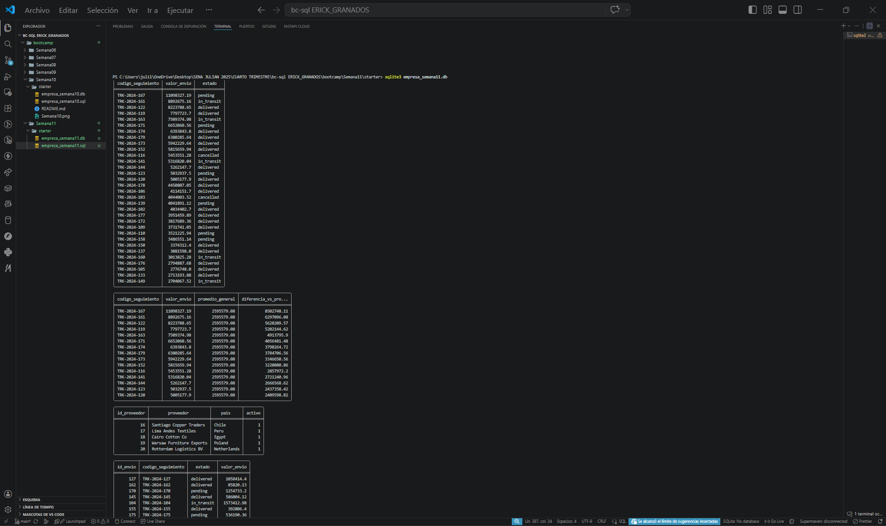
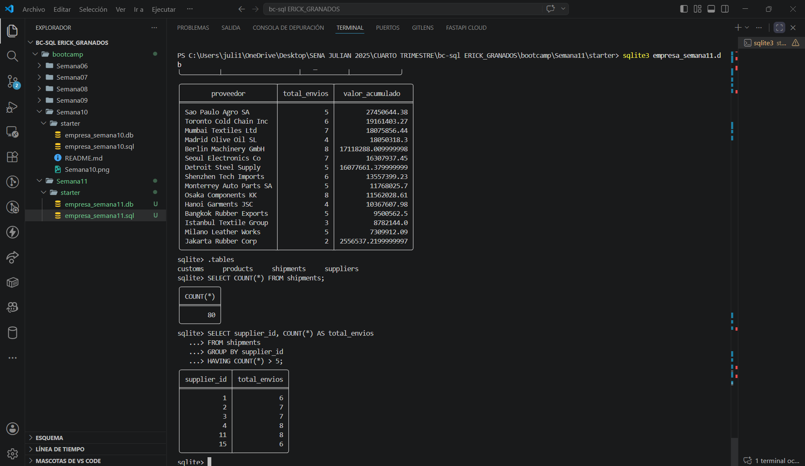

# Proyecto Semana 11 — Subqueries en tu dominio

**Dominio asignado:** Empresa de Importación (bc-sql)

---

## 📋 Descripción

Este proyecto reutiliza el esquema relacional de envíos de importación
(`suppliers`, `products`, `shipments`, `customs`) para aplicar subqueries
escalares, `NOT EXISTS` y tablas derivadas en reportes analíticos sobre
el valor de los envíos y la actividad de los proveedores.

---

## 🗂️ Estructura del esquema

| Tabla         | Rol                  | Filas | Casos de inclusión/exclusión                     |
|---------------|----------------------|-------|----------------------------------------------------|
| `suppliers`   | Referencia            | 20    | 5 proveedores SIN ningún envío (para NOT EXISTS)  |
| `products`    | Referencia            | 20    | —                                                    |
| `shipments`   | **Principal**         | 80    | Distribución variada de `status` y `total_value`   |
| `customs`     | Secundaria (hija)     | 65    | 15 envíos SIN trámite de aduana (para NOT EXISTS) |

---

## 🔎 Subqueries incluidas

| # | Consulta | Tipo de subquery | Qué retorna la subquery |
|---|----------|-------------------|---------------------------|
| 1 | Envíos por encima del promedio | Escalar en `WHERE` | Un solo número: `AVG(total_value)` de todos los envíos |
| 2 | Cada envío + promedio global + diferencia | Escalar en `SELECT` | El mismo promedio, repetido por cada fila para comparar |
| 3 | Proveedores sin ningún envío | `NOT EXISTS` correlacionado | Busca, por cada proveedor, si existe algún envío suyo |
| 3b| Envíos sin trámite de aduana | `NOT EXISTS` correlacionado | Busca, por cada envío, si existe su registro en `customs` |
| 4 | Proveedores con valor acumulado > 1.000.000 USD | Tabla derivada en `FROM` | Subquery agrupada (`GROUP BY`) tratada como tabla con alias `rp` |

---

## ▶️ Cómo ejecutar el proyecto

### 1. Abre SQLite apuntando al archivo `.db`

```bash
sqlite3 empresa_semana11.db
```

👉 Si el archivo no existe, SQLite lo crea vacío.

### 2. Ejecuta tu script `.sql` completo

Dentro del prompt de SQLite:

```sql
.read proyecto_semana11.sql
```

👉 Esto crea las 4 tablas, inserta los datos y ejecuta las consultas con subqueries.

### 3. Verifica que las tablas se crearon

```sql
.tables
```

👉 Te debe mostrar `suppliers`, `products`, `shipments`, `customs`.

### 4. Prueba tus consultas de evidencia

```sql
-- Promedio global de valor por envío
SELECT AVG(total_value) FROM shipments;

-- Proveedores que nunca han enviado nada (NOT EXISTS)
SELECT name FROM suppliers s
WHERE NOT EXISTS (
    SELECT 1 FROM shipments sh WHERE sh.supplier_id = s.supplier_id
);

-- Envíos sin trámite de aduana (NOT EXISTS)
SELECT tracking_code FROM shipments sh
WHERE NOT EXISTS (
    SELECT 1 FROM customs c WHERE c.shipment_id = sh.shipment_id
);
```

### 5. Salir de SQLite

```sql
.exit
```

---
---
## capturas de pantalla



## 📁 Archivos del proyecto

```
.
├── proyecto_semana11.sql   # Script completo: DDL + DML + 4 subqueries
├── empresa_semana11.db     # Base de datos generada (SQLite format 3)
└── README.md               # Este archivo
```

---

## ✅ Checklist de requisitos cumplidos

- [x] ≥80 filas en tabla principal (`shipments`: 80)
- [x] ≥20 filas en cada tabla secundaria (`suppliers`: 20, `products`: 20, `customs`: 65)
- [x] Casos reales de inclusión y exclusión (5 proveedores sin envíos, 15 envíos sin aduana)
- [x] Consulta 1 — Subquery escalar en `WHERE` (`AVG`)
- [x] Consulta 2 — Subquery escalar repetida en `SELECT`
- [x] Consulta 3 — `NOT EXISTS` correlacionado (dos variantes)
- [x] Consulta 4 — Tabla derivada en `FROM` con alias correcto (`rp`)
- [x] Comentarios en español explicando qué retorna cada subquery
- [x] Ningún `SELECT *`
- [x] Archivo ejecuta sin errores de principio a fin