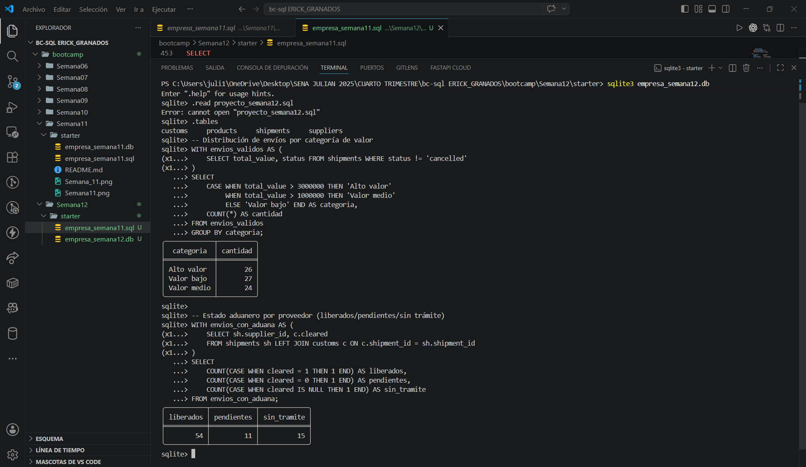

# Proyecto Semana 12 — CTEs y CASE WHEN en tu dominio

**Dominio asignado:** Empresa de Importación (bc-sql)

---

## 📋 Descripción

Este proyecto reutiliza el esquema de envíos de importación
(`suppliers`, `products`, `shipments`, `customs`) para construir reportes
analíticos combinando **CTEs** (simples y encadenados) con **CASE WHEN**,
clasificando envíos por rango de valor y proveedores por nivel de
importancia y estado aduanero.

---

## 🗂️ Estructura del esquema

| Tabla         | Rol                  | Filas |
|---------------|----------------------|-------|
| `suppliers`   | Referencia            | 20    |
| `products`    | Referencia            | 20    |
| `shipments`   | **Principal**         | 80    |
| `customs`     | Secundaria (hija)     | 65    |

Los umbrales de clasificación (`CASE WHEN`) se calibraron según los
percentiles reales del valor de los envíos (`total_value`), para que la
distribución resultante sea representativa y no esté concentrada en una
sola categoría.

---

## 🧩 Consultas con CTE + CASE WHEN incluidas

| # | Consulta | CTE(s) | CASE WHEN |
|---|----------|--------|-----------|
| 1 | Clasificación de envíos por rango de valor | 1 CTE simple (`envios_validos`, excluye cancelados) | 3 ramas: Alto / Medio / Bajo valor |
| 2 | Proveedores destacados por actividad y volumen | 2 CTEs encadenados (`metricas_proveedor` → `proveedores_destacados`) | 3 ramas: Estratégico / Relevante / Destacado |
| 3 | Estado aduanero por proveedor | 1 CTE que combina `shipments` + `customs` (`envios_con_aduana`) | `COUNT(CASE WHEN ...)` para liberados / pendientes / sin trámite |

**Distribución real obtenida (consulta 1):** 26 envíos de alto valor,
24 de valor medio, 27 de valor bajo — sobre 77 envíos no cancelados.

---

## ▶️ Cómo ejecutar el proyecto

### 1. Abre SQLite apuntando al archivo `.db`

```bash
sqlite3 empresa_semana12.db
```

👉 Si el archivo no existe, SQLite lo crea vacío.

### 2. Ejecuta tu script `.sql` completo

Dentro del prompt de SQLite:

```sql
.read proyecto_semana12.sql
```

👉 Esto crea las 4 tablas, inserta los datos y ejecuta las 3 consultas con CTE + CASE WHEN.

### 3. Verifica que las tablas se crearon

```sql
.tables
```

👉 Te debe mostrar `suppliers`, `products`, `shipments`, `customs`.

### 4. Prueba tus consultas de evidencia

```sql
-- Distribución de envíos por categoría de valor
WITH envios_validos AS (
    SELECT total_value, status FROM shipments WHERE status != 'cancelled'
)
SELECT
    CASE WHEN total_value > 3000000 THEN 'Alto valor'
         WHEN total_value > 1000000 THEN 'Valor medio'
         ELSE 'Valor bajo' END AS categoria,
    COUNT(*) AS cantidad
FROM envios_validos
GROUP BY categoria;

-- Estado aduanero por proveedor (liberados/pendientes/sin trámite)
WITH envios_con_aduana AS (
    SELECT sh.supplier_id, c.cleared
    FROM shipments sh LEFT JOIN customs c ON c.shipment_id = sh.shipment_id
)
SELECT
    COUNT(CASE WHEN cleared = 1 THEN 1 END) AS liberados,
    COUNT(CASE WHEN cleared = 0 THEN 1 END) AS pendientes,
    COUNT(CASE WHEN cleared IS NULL THEN 1 END) AS sin_tramite
FROM envios_con_aduana;
```

### 5. Salir de SQLite

```sql
.exit
```

---

## captura de pantalla

## 📁 Archivos del proyecto

```
.
├── proyecto_semana12.sql   # Script completo: DDL + DML + 3 consultas con CTE/CASE WHEN
├── empresa_semana12.db     # Base de datos generada (SQLite format 3)
└── README.md               # Este archivo
```

---

## ✅ Checklist de requisitos cumplidos

- [x] ≥80 filas en tabla principal (`shipments`: 80), con variación real en `total_value` y `status`
- [x] Consulta 1 — CTE simple + CASE WHEN (3 ramas)
- [x] Consulta 2 — Dos CTEs encadenados (el segundo referencia al primero)
- [x] Consulta 3 — CTE que combina 2 tablas + `COUNT(CASE WHEN ...)` por categoría
- [x] `CASE WHEN` con mínimo 3 ramas (2 `WHEN` + `ELSE`) en cada caso aplicable
- [x] Comentarios en español explicando el propósito de cada CTE
- [x] Ningún `SELECT *`
- [x] Archivo ejecuta sin errores de principio a fin