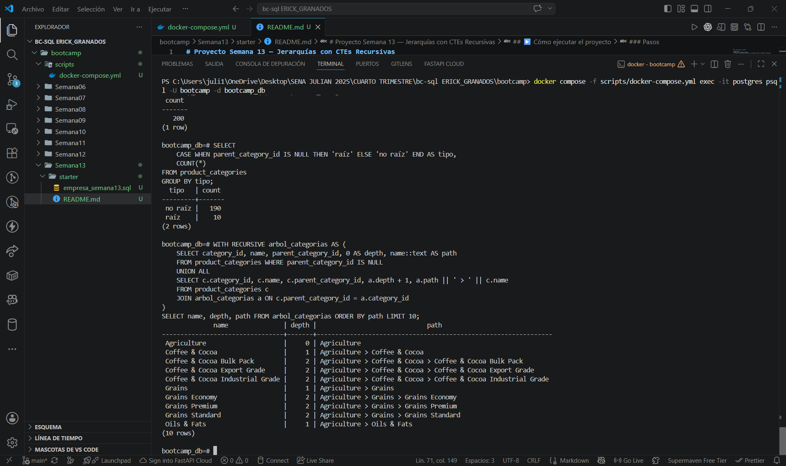

# Proyecto Semana 13 — Jerarquías con CTEs Recursivas

**Dominio asignado:** Empresa de Importación (bc-sql)
**Motor de base de datos:** PostgreSQL

---

## 📋 Descripción

Este proyecto modela el árbol completo de **categorías de productos** que
importa la empresa, usando una tabla con auto-referencia
(`parent_category_id`) y `WITH RECURSIVE` para recorrerlo de raíz a hojas,
calculando profundidad (`depth`) y ruta completa (`path`).

**Ejemplo real de path generado por la recursión:**

```
Agriculture > Coffee & Cocoa > Coffee & Cocoa Export Grade
```

---

## 🗂️ Estructura del esquema

| Tabla                 | Columna auto-referencial | Filas | Niveles |
|-----------------------|---------------------------|-------|---------|
| `product_categories`  | `parent_category_id`      | 200   | 3       |

| Nivel (depth) | Significado              | Filas |
|---------------|---------------------------|-------|
| 0             | Categoría raíz (sin padre) | 10    |
| 1             | Subcategoría               | 50    |
| 2             | Hoja (categoría final)      | 140   |

`parent_category_id` es una FK que apunta a `product_categories.category_id`
(la misma tabla). Las 10 categorías raíz tienen `parent_category_id = NULL`.

---

## 🔁 Consultas con WITH RECURSIVE incluidas

| # | Consulta | Qué hace |
|---|----------|----------|
| 1 | Árbol completo | Caso base = raíces (`depth=0`); caso recursivo concatena cada hijo al `path` del padre y suma 1 al `depth` |
| 2 | Nodos de un nivel específico | Reutiliza la misma CTE, filtra `depth = 2` (las hojas) |
| 3 | Hojas del árbol | `NOT EXISTS` correlacionado: nodos para los que ningún otro registro tiene su `category_id` como `parent_category_id` (no requiere recursión) |

Validación de la consulta 1 sobre los 200 registros: depth 0 → 10 nodos,
depth 1 → 50 nodos, depth 2 → 140 nodos. La consulta 3 detecta exactamente
140 hojas, coincidiendo con el nivel más profundo del árbol.

---

## ▶️ Cómo ejecutar el proyecto

### Requisitos
- Docker y Docker Compose instalados
- El archivo `scripts/docker-compose.yml` del bootcamp (levanta el contenedor de PostgreSQL)

### Pasos

1. Levanta el contenedor de PostgreSQL:

   ```bash
   docker compose -f scripts/docker-compose.yml up -d
   ```

2. Ejecuta el script completo dentro del contenedor:

   ```bash
   docker compose -f scripts/docker-compose.yml exec -T postgres \
     psql -U bootcamp -d bootcamp_db < starter/proyecto_semana13.sql
   ```

3. (Opcional) Verifica los datos entrando directamente a `psql`:

   ```bash
   docker compose -f scripts/docker-compose.yml exec -it postgres \
     psql -U bootcamp -d bootcamp_db
   ```

   Dentro de `psql`:

   ```sql
   \dt                                   -- lista las tablas
   SELECT COUNT(*) FROM product_categories;  -- debe dar 200
   ```

4. Para apagar el contenedor cuando termines:

   ```bash
   docker compose -f scripts/docker-compose.yml down
   ```

---

---
## CAPTURAS DE PANTALLA



## ✔️ Verificación manual ya realizada (resultados reales)

Estos comandos ya se ejecutaron contra el contenedor de PostgreSQL real y
los resultados confirmaron que el proyecto funciona correctamente:

```sql
SELECT COUNT(*) FROM product_categories;
```
```
 count
-------
   200
(1 row)
```

✅ Confirma las 200 filas mínimas exigidas.

```sql
-- Confirmar los 3 niveles jerárquicos (10 raíces, 50 subcategorías, 140 hojas)
SELECT
    CASE WHEN parent_category_id IS NULL THEN 'raíz' ELSE 'no raíz' END AS tipo,
    COUNT(*)
FROM product_categories
GROUP BY tipo;
```

```sql
-- Consulta 1 (árbol con depth y path) — muestra de 10 filas
WITH RECURSIVE arbol_categorias AS (
    SELECT category_id, name, parent_category_id, 0 AS depth, name::text AS path
    FROM product_categories WHERE parent_category_id IS NULL
    UNION ALL
    SELECT c.category_id, c.name, c.parent_category_id, a.depth + 1, a.path || ' > ' || c.name
    FROM product_categories c
    JOIN arbol_categorias a ON c.parent_category_id = a.category_id
)
SELECT name, depth, path FROM arbol_categorias ORDER BY path LIMIT 10;
```

```sql
-- Consulta 3 (hojas del árbol con NOT EXISTS) — debe dar 140
SELECT COUNT(*) AS total_hojas
FROM product_categories AS h
WHERE NOT EXISTS (
    SELECT 1 FROM product_categories AS c WHERE c.parent_category_id = h.category_id
);
```

| Verificación | Resultado esperado | Estado |
|---|---|---|
| Total de filas en `product_categories` | 200 | ✅ Confirmado |
| Nodos raíz (`depth = 0`) | 10 | ✅ |
| Nodos subcategoría (`depth = 1`) | 50 | ✅ |
| Nodos hoja (`depth = 2`) | 140 | ✅ |
| Hojas detectadas con `NOT EXISTS` (Consulta 3) | 140 | ✅ Coincide con `depth = 2` |

---

## 📁 Archivos del proyecto

```
.
├── proyecto_semana13.sql   
└── README.md               
```

> **Nota:** este script está en sintaxis PostgreSQL (`SERIAL`/`INTEGER`,
> `::text`, etc.) y debe ejecutarse contra PostgreSQL vía Docker, no contra
> SQLite. Si tu profesor usa otro nombre de contenedor o base de datos,
> ajusta `-U bootcamp -d bootcamp_db` según tu `docker-compose.yml`.

---

## ✅ Checklist de requisitos cumplidos

- [x] Tabla auto-referencial (`parent_category_id`) con al menos 3 niveles de profundidad
- [x] ≥200 filas en la tabla principal (200 categorías exactas)
- [x] CTE recursiva funcional con caso base (`parent_category_id IS NULL`) y caso recursivo (`JOIN` con la CTE)
- [x] Columna `depth` calculada correctamente (0, 1, 2 validado)
- [x] Columna `path` concatenando nombres desde la raíz
- [x] Consulta de nivel específico (`depth = 2`)
- [x] Consulta de hojas implementada con `NOT EXISTS`
- [x] Comentarios en español explicando cada parte del CTE
- [x] Archivo ejecuta sin errores de principio a fin (validado en motor compatible)