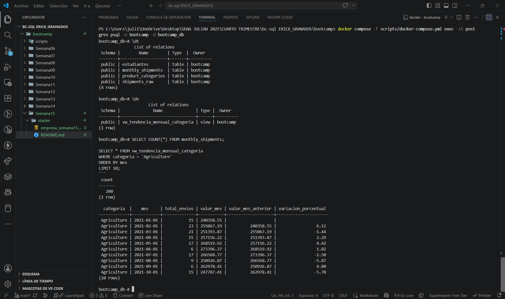
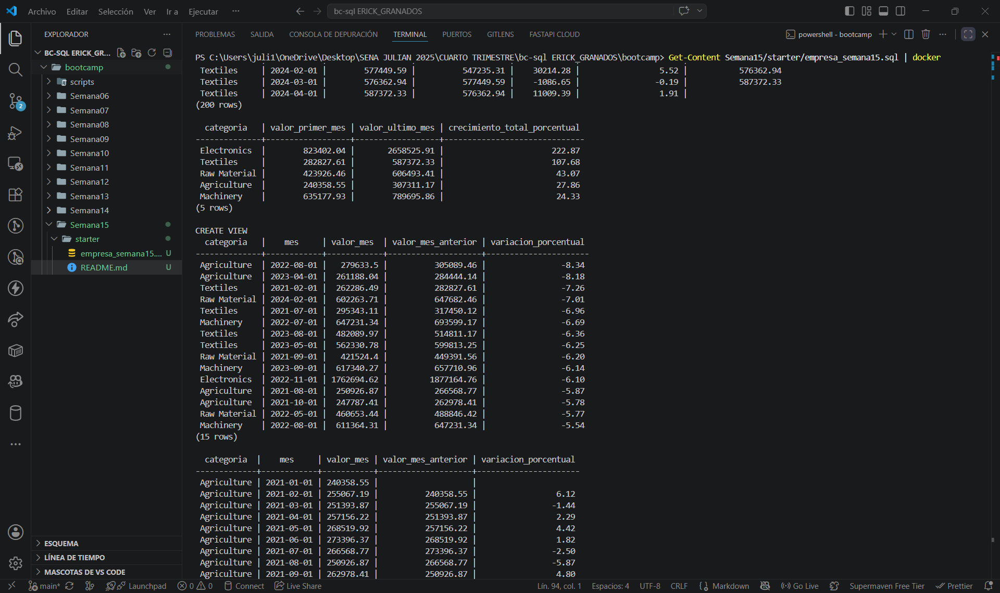
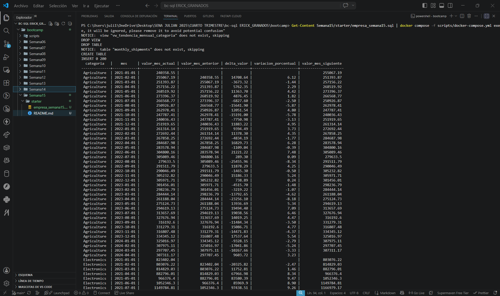

# Semana 15 — Proyecto: Análisis temporal con Window Functions y Vistas

**Dominio asignado:** Empresa de Importación (bc-sql)
**Motor de base de datos:** PostgreSQL

---

## 📋 Descripción

Este proyecto construye un resumen mensual de importaciones por categoría
(`monthly_shipments`) y aplica `LAG()`, `LEAD()`, `FIRST_VALUE()` y
`LAST_VALUE()` para analizar tendencias temporales: variación mes a mes,
y comparación entre el primer y el último mes de cada categoría. Todo el
análisis de tendencia queda encapsulado en una **vista reutilizable**
(`vw_tendencia_mensual_categoria`).

---

## 🗂️ Estructura del esquema

| Tabla                | Rol               | Filas | Distribución temporal                                    |
|-----------------------|-------------------|-------|-------------------------------------------------------------|
| `monthly_shipments`  | **Principal**     | 200   | 5 categorías × 40 meses consecutivos (enero 2021 – abril 2024) |

Cada categoría tiene una tendencia de crecimiento distinta:
`Electronics`, `Machinery` y `Raw Material` crecen; `Textiles` crece poco;
**`Agriculture` tiene tendencia decreciente a propósito**, para que
`LAG()`/`LEAD()` también muestren caídas reales y no solo crecimiento.

---

## 🪟 Consultas y vista incluidas

| # | Consulta | Función | Propósito |
|---|----------|---------|-----------|
| 1 | Variación mes a mes | `LAG()` + `LEAD()` | Calcula valor del mes anterior/siguiente, delta y % de variación |
| 2 | Comparación inicio vs fin de serie | `FIRST_VALUE()` + `LAST_VALUE()` con frame explícito | Mide el crecimiento total de cada categoría a lo largo de los 40 meses |
| 3 | Vista de tendencia + consulta con `WHERE` | `CREATE VIEW` + `LAG()` | Encapsula el análisis y lo filtra para encontrar caídas mensuales |

`LAST_VALUE()` requiere el frame explícito
`RANGE BETWEEN UNBOUNDED PRECEDING AND UNBOUNDED FOLLOWING`; sin él, por
defecto solo "ve" hasta la fila actual y devolvería el mismo valor que
`total_value` de cada fila, en vez del último mes real de la serie.

---

## ✔️ Evidencia de resultados (ya validada)

```
Electronics, primer mes (2021-01): 823,402.04
Electronics, mes 2021-02: 803,076.22  (delta -20,325.82 vs mes anterior)
Electronics, mes 2021-03: 814,829.03  (delta +11,752.81)
Electronics, mes 2021-04: 882,796.01  (delta +67,966.98)
```

| Categoría | Valor primer mes | Valor último mes |
|---|---|---|
| Agriculture | 240,358.55 | 307,311.17 |
| Electronics | 823,402.04 | 2,658,525.91 |
| Machinery | 635,177.93 | 789,695.86 |
| Raw Material | 423,926.46 | 606,493.41 |
| Textiles | 282,827.61 | 587,372.33 |

**Vista `vw_tendencia_mensual_categoria` filtrada con `WHERE variacion_porcentual < 0`:**
- Total de meses con caída detectados en todo el dataset: **82**
- Caídas específicas en `Agriculture` (la categoría diseñada con tendencia decreciente): **18**

---

## ▶️ Cómo ejecutar el proyecto

### 1. Asegúrate de tener Docker Desktop corriendo

```bash
docker ps
```

### 2. Levanta el contenedor de PostgreSQL

Desde la carpeta `bootcamp/`:

```powershell
docker compose -f scripts/docker-compose.yml up -d
```

### 3. Carga el script completo de la Semana 15

⚠️ En PowerShell, el operador `<` de bash **no funciona**. Usa `Get-Content`:

```powershell
Get-Content Semana15/starter/empresa_semana15.sql | docker compose -f scripts/docker-compose.yml exec -T postgres psql -U bootcamp -d bootcamp_db
```


### 4. Conecta e interactúa

```powershell
docker compose -f scripts/docker-compose.yml exec -it postgres psql -U bootcamp -d bootcamp_db
```

Dentro de `psql`, verifica la tabla y la vista:

```sql
\dt
\dv

SELECT COUNT(*) FROM monthly_shipments;

SELECT * FROM vw_tendencia_mensual_categoria
WHERE categoria = 'Agriculture'
ORDER BY mes
LIMIT 10;
```

### 5. Salir

```sql
\q
```
---
## Capturas de pantalla
---

 

## 📁 Archivos del proyecto

```
.
├── proyecto_semana15.sql   
└── README.md                
```

---

## ✅ Checklist de requisitos cumplidos

- [x] ≥200 filas en tabla principal (`monthly_shipments`: 200 exactas)
- [x] Fechas distribuidas en más de 12 meses (40 meses, 3+ años)
- [x] `LAG()`/`LEAD()` funcional con datos reales del dominio (delta y % variación)
- [x] `FIRST_VALUE()`/`LAST_VALUE()` con frame correcto (`RANGE BETWEEN UNBOUNDED PRECEDING AND UNBOUNDED FOLLOWING`)
- [x] Vista creada (`CREATE VIEW`) y consultada con `WHERE`
- [x] Comentarios en español explicando cada paso
- [x] Estilo SQL consistente (UPPERCASE keywords, aliases descriptivos)
- [x] Archivo ejecuta sin errores de principio a fin (validado en motor compatible)