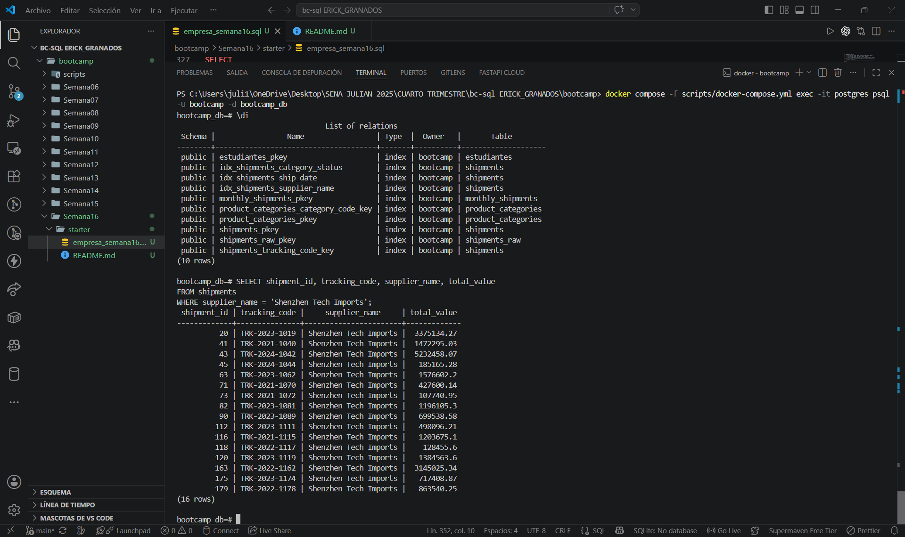
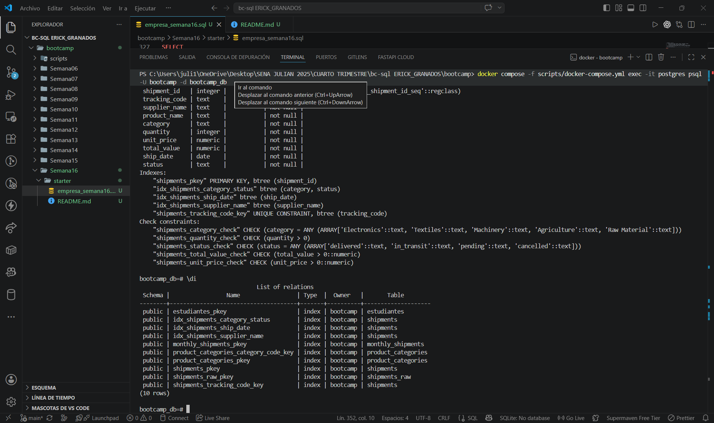
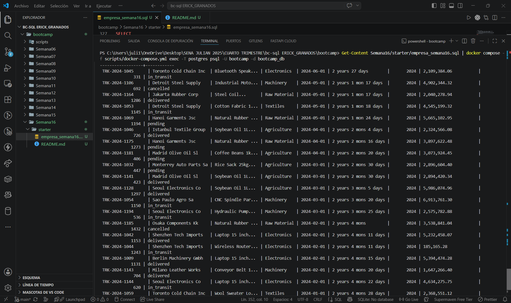

# Semana 16 — Proyecto: Índices y Consultas Optimizadas

**Dominio asignado:** Empresa de Importación (bc-sql)
**Motor de base de datos:** PostgreSQL

---

## 📋 Descripción

Este proyecto mide el plan de ejecución de dos consultas frecuentes
(búsqueda por proveedor y por rango de fechas) **antes y después** de
crear índices estratégicos sobre `shipments`, y construye un reporte
final que combina funciones de texto, fecha y numéricas.

---

## 🗂️ Estructura del esquema

| Tabla        | Rol            | Filas | Particularidad                                         |
|--------------|----------------|-------|-----------------------------------------------------------|
| `shipments`  | **Principal**  | 200   | Fechas distribuidas entre 2021-01 y 2024-06 (3+ años)     |

**Índices creados (después de la medición "antes"):**

| Índice | Columna(s) | Justificación |
|---|---|---|
| `idx_shipments_supplier_name` | `supplier_name` | La consulta más frecuente del negocio: "envíos de tal proveedor" |
| `idx_shipments_ship_date` | `ship_date` | Reportes mensuales/anuales filtran constantemente por rango de fechas |
| `idx_shipments_category_status` | `category, status` (compuesto) | Reportes cruzados, ej. "envíos pendientes de Electronics" |

---

## 📊 EXPLAIN ANALYZE — antes y después

Se midieron dos consultas:
1. `WHERE supplier_name = 'Shenzhen Tech Imports'` (16 filas de muestra real)
2. `WHERE ship_date BETWEEN '2023-01-01' AND '2023-12-31'` (51 filas de muestra real)

> **Nota importante sobre el resultado esperado:** con una tabla de 200
> filas, es **normal y esperado** que PostgreSQL siga eligiendo `Seq Scan`
> incluso después de crear el índice. El planificador de costos decide el
> plan más barato, no el que "use" el índice por obligación — y para tan
> pocas filas, recorrer la tabla secuencialmente puede ser más rápido que
> saltar entre páginas del índice. La diferencia real se vuelve evidente
> a partir de varios miles de filas, donde el `Index Scan` empieza a
> ganar de forma consistente. Lo importante de esta entrega es **saber
> leer e interpretar el plan**, no forzar un cambio de plan en una tabla
> pequeña.

Pega aquí el resultado real de tu `EXPLAIN ANALYZE` (antes y después) una
vez lo ejecutes en tu PostgreSQL — ese es la evidencia que pide la rúbrica.

---

## 🧩 Reporte final — funciones combinadas

| Tipo de función | Funciones usadas | Columna resultante |
|---|---|---|
| Texto | `UPPER`, `INITCAP`, `SUBSTRING`, `CONCAT` | código en mayúsculas, proveedor en formato título, producto resumido |
| Fecha | `DATE_TRUNC('month', ...)`, `AGE()`, `EXTRACT(YEAR FROM ...)` | mes de envío, antigüedad desde hoy, año extraído |
| Numérica | `ROUND`, `TO_CHAR` (formato moneda), `CEIL` | valor total formateado, precio unitario redondeado hacia arriba |

---

## ▶️ Cómo ejecutar el proyecto

### 1. Asegúrate de tener Docker Desktop corriendo

```bash
docker ps
```

### 2. Levanta el contenedor de PostgreSQL

Desde la carpeta `bootcamp/`:

```powershell
docker compose -f scripts/docker-compose.yml up -d
```

### 3. Carga el script completo de la Semana 16

⚠️ En PowerShell, el operador `<` de bash **no funciona**. Usa `Get-Content`:

```powershell
Get-Content Semana16/starter/empresa_semana16.sql | docker compose -f scripts/docker-compose.yml exec -T postgres psql -U bootcamp -d bootcamp_db
```


### 4. Conecta e interactúa (para repetir EXPLAIN manualmente)

```powershell
docker compose -f scripts/docker-compose.yml exec -it postgres psql -U bootcamp -d bootcamp_db
```

Dentro de `psql`:

```sql
\d shipments      -- ver columnas y los índices ya creados
\di               -- listar todos los índices de la base

EXPLAIN ANALYZE
SELECT shipment_id, tracking_code, supplier_name, total_value
FROM shipments
WHERE supplier_name = 'Shenzhen Tech Imports';
```

### 5. Salir

```sql
\q
```
---

## Capturas de pantalla




---

## 📁 Archivos del proyecto

```
.
├── proyecto_semana16.sql   # Script completo: DDL + DML + EXPLAIN antes/después + índices + reporte
└── README.md                # Este archivo
```

---

## ✅ Checklist de requisitos cumplidos

- [x] ≥200 filas en tabla principal (`shipments`: 200 exactas)
- [x] Índice creado y verificado con `EXPLAIN ANALYZE` (antes y después)
- [x] 3 índices estratégicos justificados (proveedor, fecha, compuesto categoría+estado)
- [x] Funciones de texto aplicadas correctamente (`UPPER`, `INITCAP`, `SUBSTRING`, `CONCAT`)
- [x] Funciones de fecha con `AGE()` y `DATE_TRUNC()` (más `EXTRACT`)
- [x] Funciones numéricas (`ROUND`, `CEIL`, `TO_CHAR` con formato moneda)
- [x] Reporte final combinando los tres tipos de función
- [x] Comentarios en español explicando cada paso
- [x] Archivo ejecuta sin errores de principio a fin (DDL/DML validados en motor compatible)